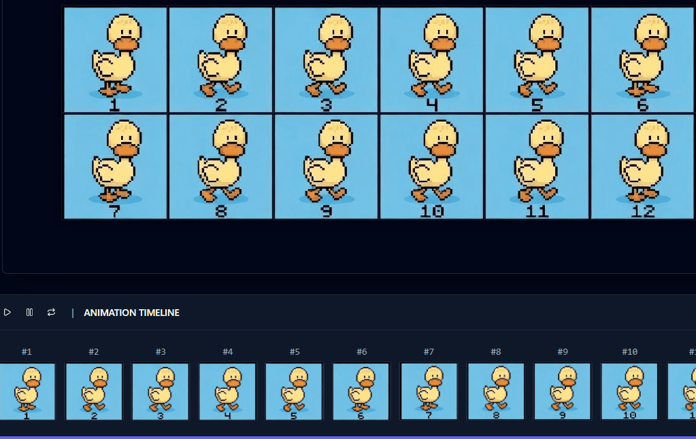

<p align="center">
  
</p>

<h1 align="center">SpriteCut</h1>

<p align="center">
  
</p>

<p align="center">
  ✂️ Premium open-source sprite sheet cutter & GIF animation studio<br/>
  Built for game devs, pixel artists, and creative workflows.
</p>

<p align="center">
  <a href="https://YOUR_DEPLOY_URL">
    
  </a>
  
  
  
</p>

---

<p align="center">
  
</p>

---

## ✨ What is SpriteCut?

**SpriteCut** is a modern, high-performance, fully client-side tool for:

- slicing sprite sheets  
- building animations visually  
- exporting optimized results  

Everything runs directly in your browser — no installs, no uploads, no backend.

---

## ✂️ Features

### 🎞 Sprite Sheet Cutting
- Upload any sprite sheet (PNG, GIF, JPG, WebP)
- Real-time **grid overlay preview**
- Slice by:
  - Tile size (width / height)
  - Columns / rows
- Advanced controls:
  - offsets  
  - spacing  
  - start index  
- Instant visual feedback via Canvas

---

### 🎬 Animation Timeline
- Drag & drop frame reordering  
- Duplicate / delete frames  
- Thumbnail timeline dock  
- Live preview player:
  - play / pause  
  - step forward / backward  
- Per-frame timing overrides  
- Global FPS control  

---

### 🎨 Export System
- Export **Animated GIF**
- Export **PNG Sequence (ZIP)**
- Quality presets:
  - Best Quality  
  - Balanced  
  - Smallest Size  
- Transparency optimization  
- Loop controls (infinite / custom / once)  

---

## ⚡ Performance & Privacy

- 100% **client-side processing**
- No uploads — your files stay local  
- Built with:
  - HTML5 Canvas  
  - gif.js  
  - jszip  

---

## 🛠 Tech Stack

- React + Vite  
- Tailwind CSS  
- shadcn/ui  
- Zustand  
- dnd-kit  
- Canvas API  
- gif.js  
- jszip  

---

## 🚀 Getting Started

```bash
git clone https://github.com/YOUR_USERNAME/YOUR_REPO.git
cd YOUR_REPO
npm install
npm run dev
```

---

## 📦 Build

```bash
npm run build
```

Output:
```
/dist
```

---

## 🌐 Deploy (Cloudflare Pages)

Build command:
```
npm run build
```

Output directory:
```
dist
```

---

## 🧠 Roadmap

- [x] Sprite slicing UI  
- [x] Grid overlay system  
- [x] Frame extraction  
- [ ] Advanced timeline editing  
- [ ] Onion skinning  
- [ ] MP4 export  
- [ ] APNG export  
- [ ] Palette optimization  
- [ ] Animation presets  

---

## 🤝 Contributing

Contributions are welcome.

Ideas:
- performance improvements  
- new export formats  
- timeline UX upgrades  
- visual polish  

Open an issue before major changes.

---

## 📄 License

MIT License

Free for personal and commercial use.

---

## ⭐ Support

If you like this project:

**Star the repo ⭐**

It helps more than you think.

---

## 🎮 Built For

- Game developers  
- Pixel artists  
- Indie studios  
- Retro creators  
- Animation prototyping  

---

<p align="center">
  Made with pixels, caffeine, and chaos.
</p>
